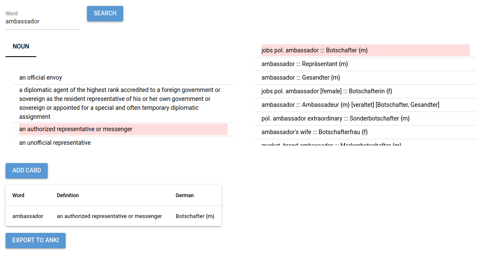

# DictionAnki
A simple and easy-to-use web application that looks up a word in an online dictionary (Merriam Webster and dict.cc are supported), lets you select a meaning and translation and adds it to a list. Once you're happy, you can export the list as a set of Anki flashcards. I wrote this mostly for personal use, so the structure of the exported Anki cards is hardcoded, but it is easy to adapt.

## Showcase

## Planned Features
- [] layout and design improvements
- [] option to select different dictionaries
- [] ability to select several meanings and translations
- [] ability to edit the cards in the list, as well as to rearrange or delete (some of) them